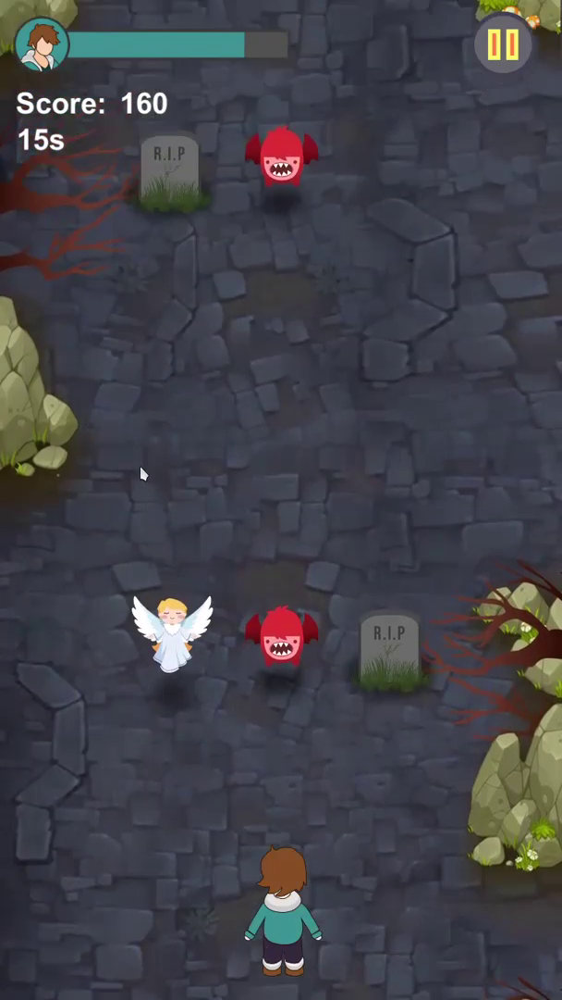

# Catching Dream

## Pembagian Role
| No | Nama                               | Role            |
|----|------------------------------------|-----------------|
| 1  | Aldi Oktaviana Hidayat - G64180005 | Game Programmer |
| 2  | Zahra Aulia Firdausi   - G64180030 | Game Design     |
| 3  | Syukriyatul Hanifa     - G64180062 | Game Artist     |

## Story Line
Catching Dream merupakan endless runner mobile game. Permainan dimulai ketika karakter yang bernama airy terjebak dalam mimpi buruknya, pemain pun harus berlari sambil mempertahankan kesadarannya untuk menemukan jalan keluar. Saat berlari, pemain dapat menggeser karakter ke kanan atau kiri untuk mengambil peri agar kesadarannya tetap terjaga dan menghindari monster serta batu nisan yang menjadi rintangan dalam menemukan jalan keluar.

## Rules
* Player 1 orang : Character bernama Airy
* Character: Airy+peri
* Obstacle : Monster dan batu nisan
* Memiliki waktu tertentu (2 menit) untuk bisa bertahan didalam dunia mimpi 
* Mengambil peri untuk menambah sanitynya +10%, skor juga berkurang 10%, 
* Sanity akan berkurang 4% seiring berjalannya waktu. 
* Ia harus menghindari batu nisan serta monster
* Apabila ia tertabrak batu nisan maka sanitynya akan berkurang 15%, skor juga berkurang 15%
* Seketika mati ketika ia menabrak monster

## Goals
Mengumpulkan peri untuk mempertahankan sanitynya agar tetap tinggi sampai waktunya habis, menghindari semua hantu dan monster. 

## Action
* Arrow kanan/kiri
* Swipe kanan/kiri

## Screenshot

  
  
  
  
  
  

## Tools yang digunakan
* `Unity Hub 2.4.2` 
   * Sebagai platform kolaborasi
   * Keunggulannya : Nice collab, gratis, open source
* `Unity Editor 2019.4.13f1 dan 2019.4.16.f1`
   * Game Editor
* `Game berbentuk 2D`
* `Perspektif game berbentuk Top Down View`
* `AI dan Photoshop`
   * Digunakan untuk pembuatan assets
   * Keunggulan :Familiar, mudah, cocok dalam pembuatan assets seperti yang sudah dikonsepkan.
* `Visual studio + GEdit`
   * Text Editor
* `Bahasa C#`
   * Bahasa pemrograman
* `Code swipe manager` 
   * Endless-Runner-Game/SwipeManager.cs at master · Chaker-Gamra/Endless-Runner-Game (github.com)
* `Github` 
   * Dokumentasi projek
* `Canva`
   * Pembuatan powerpoint dan video identitas
* `Adobe premiere Pro`
   * Digunakan untuk mengedit video

## Aset yang digunakan
### Sprite
* Airy (player)
* Monster
* Nisan
* Peri
* Black Hole
* Pagar
* Rumah
#### Source Aset gambar
https://pin.it/5Nq0J5c

### Environtment
* Background level 1:  tanah gersang
* Background level 2: tanah berbatu
* Background level 3: tanah berbatu dengan rumput
* Pohon di kanan kiri

### Musik dan SFX
   * Suara foot step: https://opengameart.org/content/foot-walking-step-sounds-on-stone-water-snow-wood-and-dirt
   * Suara pagar: https://freesound.org/people/ihitokage/sounds/394673/
   * Suara pintu: https://freesound.org/people/Robinhood76/sounds/60552/
   * Suara nabrak nisan: https://freesound.org/people/AlecCorday/sounds/169928/
   * Suara dibunuh monster: https://freesound.org/people/LucasDuff/sounds/467701/
   * Musik di level + panel pause, game over: https://opengameart.org/content/night-of-the-streets-horrorsuspense
   * Musik di main menu: https://opengameart.org/content/distant-screams-dark-ambient-horror-music-pack
   * Musik saat main: https://www.youtube.com/watch?v=rP1EHZuWvFk
   * Musik congratulation: https://freesound.org/people/metrostock99/sounds/514492/

## Teknologi
* `Translasi` efek shake ketika nabrak nisan, pindah posisi sprite, environtment gerak ke bawah
* `Skalasi` ngecilin atau ngegedein objek
* `Kedalaman warna` 32bit seperti aset asli
* `Direct painting` karena tidak memakai texture dan pencahayaan
